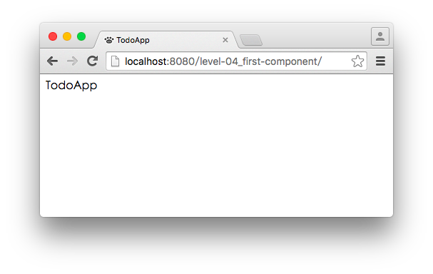

# Level 4. 完成第一個 React 元件

歡迎來到「24 小時，React 快速入門」系列教學 :mortar_board: Level 4 ～！
> :bowtie:：Wish you have a happy learning!


## :checkered_flag: 關卡目標

1. 完成主線任務：完成第一個元件 - TodoApp
2. 獲得新技能：
  1. [ES6] 宣告變數的新方式：let & const
  2. [ES6] 定義類別 (classes)
  3. [ES6] 解構賦值 (destructuring assignment)
  4. [React] 建立元件的三種方法


## :triangular_flag_on_post: 主線任務

### 1. 建立 TodoApp.js

```js
// 1. 新增一個繼承 React.Component 的子類別
class TodoApp extends React.Component {
  // 2. 必須實作 render 方法：
  //    透過該方法回傳的元素，讓 React 瞭解要如何繪製該元件在頁面上
  render() {
    return <div>TodoApp</div>;
  }
}

// 3. 將元件類別 (TodoApp) 定義在 window.App 下：
//    這可以讓其他 JS 檔使用該元件類別
window.App.TodoApp = TodoApp;
```

### 2. 編輯 index.html

```html
<body>
  <!-- 1. 初始 window.App -->
  <script>window.App = {}</script>
  <!-- 2. 引入 TodoApp.js -->
  <script type="text/babel" src="./TodoApp.js"></script>
  <script type="text/babel">
    // 3. 從 window.App 中，取得 TodoApp 元件
    const { TodoApp } = window.App;
    ReactDOM.render(
      <TodoApp />, // 4. 將 TodoApp 元件渲染在 container 中
      document.getElementById('app')
    );
  </script>
</body>
```

### 3. 確認 TodoApp 顯示在頁面上




## :book: 學習筆記

### 1. [ES6] 宣告變數的新方式：let & const

###### 1. 使用方法

```js
// 在 ES5 中，你使用 var 宣告變數，且可以賦予新值：
var text = 'hello';
text = 'world';

// 而 ES6 提供你兩個新功能：
// 1. 使用 let 宣告「區域變數」
// 2. 使用 const 宣告「常數」

// 範例如下：
let text = 'hello';
const TEXT = 'hello';

text = 'world';
TEXT = 'world'; // 發生錯誤：Uncaught SyntaxError: "TEXT" is read-only

// 上例中，因為 const 一旦宣告後，就無法重新賦值，所以發生錯誤。
// 因此 cosnt 通常用在宣告常數，那麼 let 和 var 的差別是什麼呢？

// 見下方範例：
var vText = 'vText';
let lText = 'lText';

if (true) {
  var vText = 'vText2';
  let lText = 'lText2';

  console.log(vText); // vText2
  console.log(lText); // lText2
}

console.log(vText); // vText2
console.log(lText); // lText

// It's magic!
// 上例讓我們得知：
// 在 if 區塊中使用 let 宣告的變數，只能在 if 區塊內使用；
// 而 var 卻無限制，這就是 let 和 var 的差別。

// 再看一個例子：
if (true) {
  let text = 'hello';
}
console.log(text); // 發生錯誤：Uncaught ReferenceError: text is not defined
```

> :bowtie:：小提醒，為了增加程式閱讀性和降低出錯率，建議你培養好習慣 - ***宣告變數盡量使用 let 取代 var，常數用 const***：）

###### 2. 參考連結

1. [Let + Const | Babel](https://babeljs.io/docs/learn-es2015/#let-const)
2. [const | MDN](https://developer.mozilla.org/zh-CN/docs/Web/JavaScript/Reference/Statements/const)
3. [let | MDN](https://developer.mozilla.org/zh-CN/docs/Web/JavaScript/Reference/Statements/let)

### 2. [ES6] 定義類別 (classes)

###### 1. 使用方式

```js
class Person { // 1. 使用 class 建立類別
  constructor(name) { // 2. 使用 constructor 定義建構子
    this.name = name;
  }

  speak() {
    console.log('My name is ' + this.name);
  }
}

const jason = new Person('Jason Chung');
jason.speak(); // My name is Jason Chung

class Men extends Person { // 3. 使用 extends 繼承類別
  speak() {
    super.speak(); // 4. 使用 super 呼叫父類別方法
    console.log('I\'m a man');
  }
}

const andy = new Men('Andy Lin');
andy.speak(); // My name is Andy Lin
              // I'm a man
```

###### 2. 參考連結

1. [Classes | Babel](https://babeljs.io/docs/learn-es2015/#classes)
2. [Classes | MDN](https://developer.mozilla.org/zh-TW/docs/Web/JavaScript/Reference/Classes)

### 3. [ES6] 解構賦值 (destructuring assignment)

###### 1. 使用方式

```js
const state = {
  value1: 'value1',
  value2: 'value2'
};

// ES5 取得 value1 和 value2 的方法
const value1 = state.value1;
const value2 = state.value2;
console.log(value1 + value2);

// ES6 取得 value1 和 value2 的方法
const { value1, value2 } = state;
console.log(value1 + value2);
```

> :bowtie:：當我剛開始看到「解構賦值」時，也覺得真的是太 cool 了；解構賦值也包括從陣列中取值，或是忽略某一個值等，詳細用法我建議你閱讀下方的參考連結囉～！

###### 2. 參考連結

1. [Destructuring | Babel](https://babeljs.io/docs/learn-es2015/#destructuring)
2. [解構賦值 | MDN](https://developer.mozilla.org/zh-CN/docs/Web/JavaScript/Reference/Operators/Destructuring_assignment)

### 4. [React] 建立元件的三種方法

```js
// 第一種. 使用 ES6 的類別 (classes)
class TodoApp extends React.Component {
  render() {
    return <div>TodoApp</div>;
  }
}

// 第二種. 使用 React.createClass API，通常用於 ES5 中
const TodoApp = React.createClass({
  render() {
    return <div>TodoApp</div>;
  }
});

// 第三種. 使用 function，通常用在元件只需要定義 render 方法時
const TodoApp = function() {
  return <div>TodoApp</div>;
};
```

> :bowtie:：謹記「***元件可以是 class，也可以是 function***」！


## :rocket:

｜ [主頁](../) ｜ [上一關](../level-03_hello-react) ｜ [下一關. 組合多個 React 元件](../level-05_component-composition) ｜
