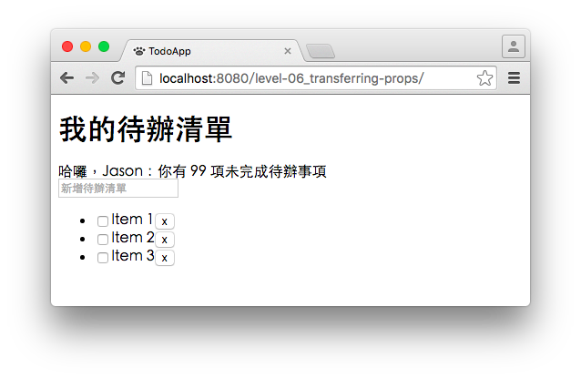

# Level 6. 使用 props 傳遞元件參數

歡迎來到「24 小時，React 快速入門」系列教學 :mortar_board: Level 6 ～！
> :bowtie:：Wish you have a happy learning!


## :checkered_flag: 關卡目標

1. 完成主線任務：讓每筆待辦項目可以顯示不同的內容
2. 獲得新技能：
  1. [React] 傳遞 props 的方式
  2. [React] 接收 props 的方式
  3. [ES6] Object rest properties
  4. [ES6] Object spread properties


## :triangular_flag_on_post: 主線任務

### 1. 讓 TodoItem 可以接收參數

```js
/** TodoItem.js */

render() {
  // 1. 從 this.props 中，取得父元件傳遞的參數
  const { title, completed } = this.props;

  // 2. 根據父元件給的 title 和 completed 渲染畫面：
  //    好處是讓資料不會寫死在元件程式中，增加元件的重用性
  return (
    <div>
      <input type="checkbox" checked={completed} />
      <span>{title}</span>
      <button>x</button>
    </div>
  );
}
```

### 2. 讓 TodoList 傳遞參數給 TodoItem

```js
/** TodoList.js */

render() {
  // 將 title 和 completed 依序傳遞給 TodoItem；
  // 傳遞參數的方式，就如同定義 HTML 元素的屬性
  return (
    <ul>
      <li>
        <TodoItem
          title="Item 1"
          completed={true}
        />
      </li>
      <li>
        <TodoItem
          title="Item 2"
          completed={false}
        />
      </li>
      <li>
        <TodoItem
          title="Item 3"
          completed={false}
        />
      </li>
    </ul>
  );
}
```

> :bowtie:：如果你在瀏覽器的開發者工具中，看到以下警示「*Warning: Failed form propType: You provided a 'checked' prop to a form field without an 'onChange' handler...*」；請放心，它只是提醒你還需要遞一些屬性給 `<input type="checkbox" />`，我們會在往後的關卡中解決它！

最後，確認瀏覽器會顯示我們要的：



### 3. 修改其他子元件

> :bowtie:：你是否體會到 props 帶來的好處呢？
> ***props 提高了元件的重用性。***

我們可以試著在其他元件中，加入 props：

###### 1. TodoHeader

考量到以下三點：
1. 往後可能需要客製化清單名稱，例如：工作清單、XX 專案清單等
2. 使用者名稱會根據登入者而不同，儘管在這個系列，我們不會有帳號功能
3. 待辦數量不應寫死在元件中，因為待辦資料應該是儲存於上層元件

因此我們加入 name(待辦清單名稱), username(使用者名稱), todoCount(待辦數量) 三個參數。

###### 2. InputField

考量到往後編輯項目時會使用該元件，提示文字（新增待辦事項）不應該寫死於元件中；因此提供一個參數：placeholder(背景提示文字)。

> :bowtie:：
>   這一關卡中，我們就先修改上面兩個元件；你可能會發現 TodoList 的資料也不應該寫死在元件內，不過這我們會在往後的關卡解決！
>   最重要的是經過了幾個練習，再詢問自己「***是否了解 props 的使用時機呢？***」！


## :book: 學習筆記

### 1. [React] 傳遞 props 的方式

###### 1. 使用方法

```js
// 1. 使用屬性的方式傳遞 props 給元件
ReactDOM.render(
  <TodoApp
    username="Jason"
    todos={['Item1', 'Item2']}
  />,
  document.getElementById('app')
);

// 2. 使用 Object spread properties（詳見[學習筆記 4]）
const props = {
  username: 'Jason',
  todos: ['Item1', 'Item2']
};

ReactDOM.render(
  <TodoApp {...props} />, // 與第一種方式傳遞的參數一樣
  document.getElementById('app')
);

// 3. 使用 object rest/spread properties（詳見[學習筆記 3 & 4]）
const data = {
  appName: 'TodoApp',
  username: 'Jason',
  todos: ['Item1', 'Item2']
};
const { appName, ...props } = data;

ReactDOM.render(
  <TodoApp {...props} />, // 與第一種方式傳遞的參數一樣
  document.getElementById('app')
);
```

###### 2. 參考連結

1. [Transferring Props | React](https://facebook.github.io/react/docs/transferring-props.html)
2. [JSX Spread Attributes | React](https://facebook.github.io/react/docs/jsx-spread.html)

### 2. [React] 接收 props 的方式

###### 1. 使用方法

```js
// 1. 上層元件傳遞的參數，可以從 this.props 中取得
class TodoApp extends React.Component {
  render() {
    // 如果你好奇 ... 表達的意思，請往[學習筆記 3]：）
    const { appName, todos, ...rest } = this.props;

    console.log(appName); // "TodoApp"
    console.log(todos);   // ['Item1', 'Item2']
    console.log(rest);    // { firstName: 'Jason', lastName: 'Chung' }

    return <div></div>;
  }
}

ReactDOM.render(
  <TodoApp
    appName="TodoApp"
    todos={['Item1', 'Item2']}
    firstName="Jason"
    lastName="Chung"
  />,
  document.getElementById('app')
);

// 2. 使用 React.createClass 建立元件時，也是從 this.props 中取得
const TodoApp = React.createClass({
  render() {
    const { appName, todos, ...rest } = this.props;
    return <div></div>;
  }
});

// 3. 使用 function 建立元件時，是從參數中取得
const TodoApp = (props) => <div></div>;

// 4. 呈 3.，或是透過 destructuring assignment (解構賦值)，取得 props 中的值
const TodoApp = ({ appName, todos }) => <div></div>;
```

### 3. [ES6] Object rest properties

###### 1. 使用方法

```js
const user = {
  firstName: 'Jason',
  lastName: 'Chung',
  sex: 'male',
  age: 27
};

// 如果你要取出 sex 和 age，並將它包裝成 others 物件...

// 在 ES5 中，你要這樣做：
var others = {
  sex: user.sex,
  age: user.age
};
console.log(others); // { sex: 'male', age: 27 }

// 在 ES6 中，你要這樣做：
const { firstName, lastName, ...others } = user;
console.log(others); // { sex: 'male', age: 27 }
```

###### 2. 參考連結

1. [Object Rest/Spread Properties for ECMAScript](https://github.com/sebmarkbage/ecmascript-rest-spread)

### 4. [ES6] Object spread properties

###### 1. 使用方法

```js
const firstName = 'Jason';
const lastName = 'Chung';
const others = {
  sex: 'male',
  age: 27
};

// 如果你要將上面這些值組合成 user 物件...

// 在 ES5 中，你要這樣做：
var user = {
  firstName: firstName,
  lastName: lastName,
  sex: others.sex,
  age: others.age
};

// 在 ES6 中，你要這樣做：
const user = { firstName, lastName, ...others };
```

###### 2. 參考連結

1. [Object Rest/Spread Properties for ECMAScript](https://github.com/sebmarkbage/ecmascript-rest-spread)


## :rocket:

｜ [主頁](../) ｜ [上一關](../level-05_component-composition) ｜ [下一關. 培養好習慣，設計防呆的 React 元件](../level-07_prop-types-n-default-values) ｜
